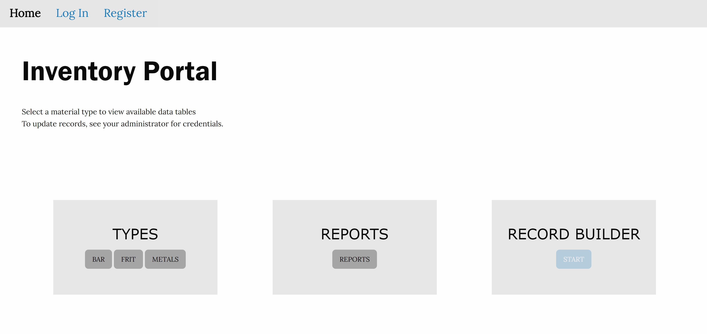
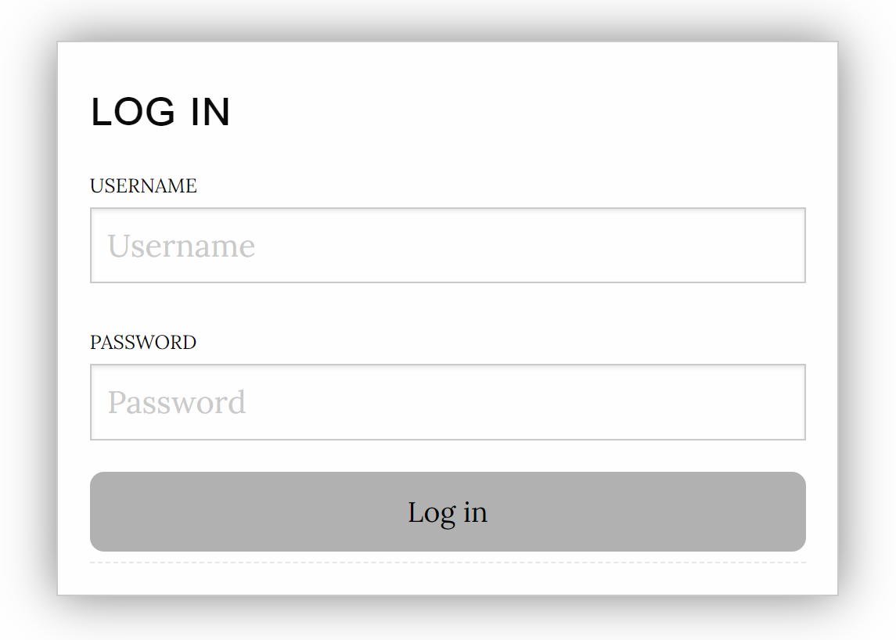
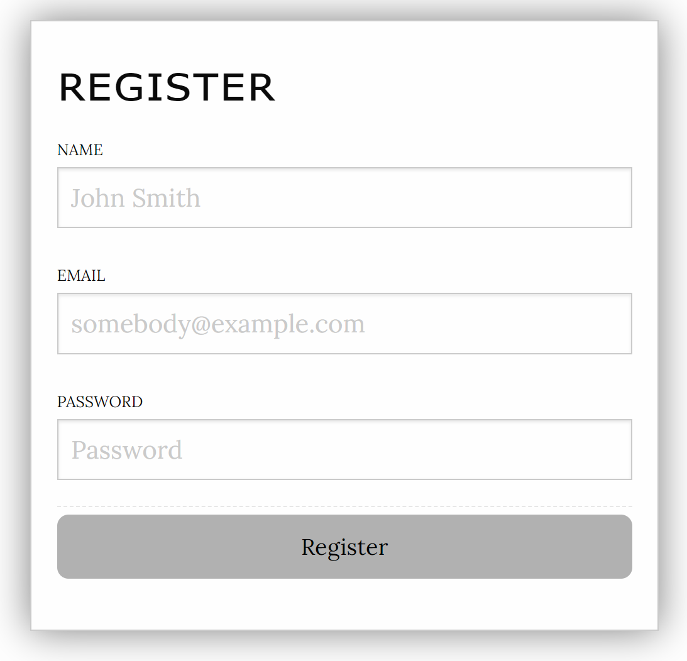
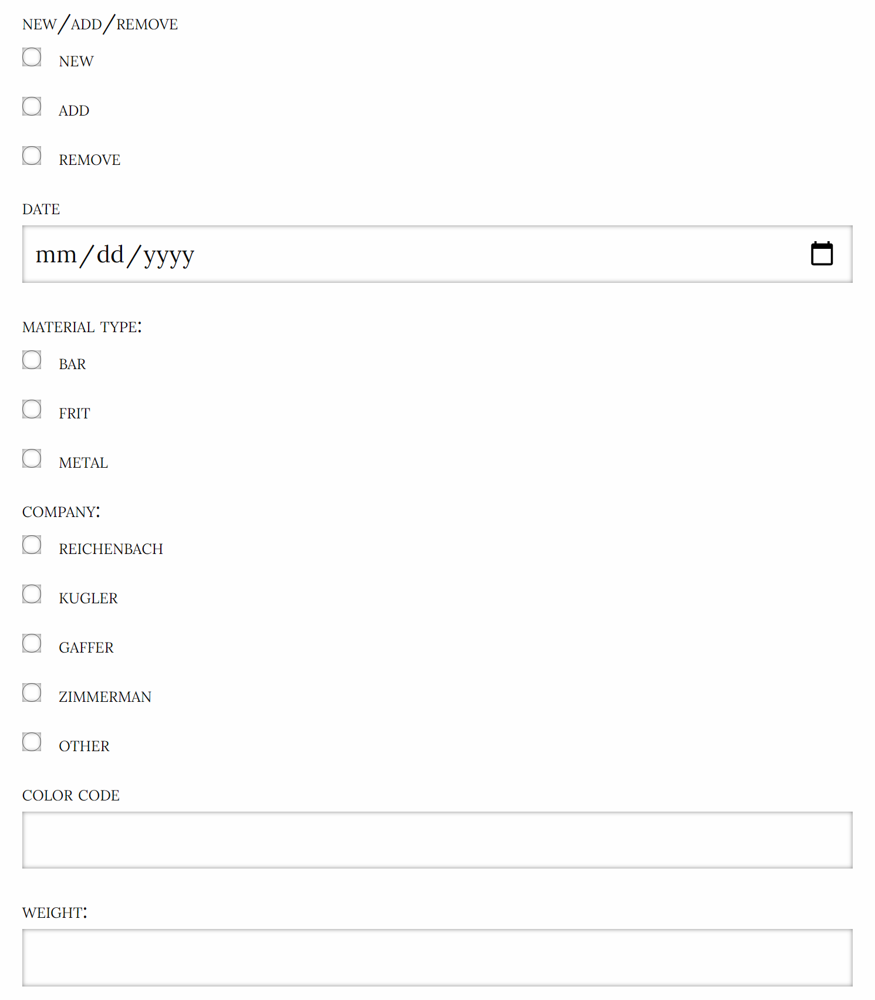
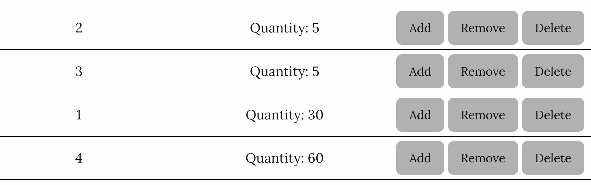
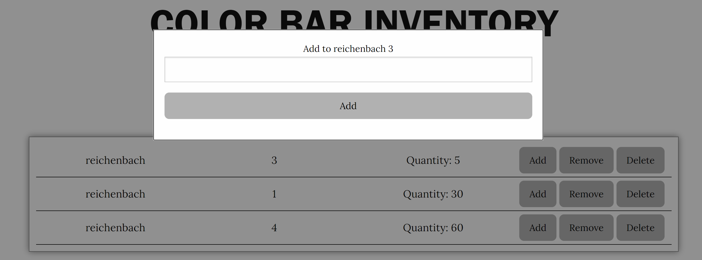

[![Contributors][contributors-shield]][contributors-url]
[![Issues][issues-shield]][issues-url]
[![MIT License][license-shield]][license-url]


<br />
<p align="center">
  <h3 align="center">Inventory Portal</h3>
  <p align="center">
    An awesome way to keep track of materials!!
    <br />
    <a href="https://github.com/jazznerd206/CH-inventory"><strong>Explore the docs »</strong></a>
    <br />
    ·
    <a href="https://github.com/jazznerd206/CH-inventory/issues">Report Bug</a>
    ·
    <a href="https://github.com/jazznerd206/CH-inventory/issues">Request Feature</a>
  </p>
</p>


<details open="open">
  <summary>Table of Contents</summary>
  <ol>
    <li>
      <a href="#about-the-project">About The Project</a>
      <ul>
        <li><a href="#built-with">Built With</a></li>
      </ul>
    </li>
    <li>
      <a href="#getting-started">Getting Started</a>
      <ul>
        <li><a href="#prerequisites">Prerequisites</a></li>
        <li><a href="#installation">Installation</a></li>
      </ul>
    </li>
    <li><a href="#usage">Usage</a></li>
    <li><a href="#roadmap">Roadmap</a></li>
    <li><a href="#contributing">Contributing</a></li>
    <li><a href="#license">License</a></li>
    <li><a href="#contact">Contact</a></li>
    <li><a href="#acknowledgements">Acknowledgements</a></li>
  </ol>
</details>




## About The Project
<br>
<h3>Hey!! You've found an inventory portal, congratulations. Before you go exploring, here are some things to know:</h3>
<ul>
<li>
  This particular portal was developed to handle data about materials used in production at a glass blowing studio. The material types <strong>bar</strong> and <strong>frit</strong> refer to the different styles of pigmentation used to augment clear glass, while the metal category holds data about the leaves and foils that are use decoratively on the surface.
 </li>
 <li>
  You may notice that some of the buttons are disabled if there is no user logged in. This is because while anyone needs to be able to look up a material to see if there is any in stock, only people with certain privileges should be allowed to update the database. To that end, the record builder and all add/remove/delete functionality from the tables has been disabled unless there is a user logged in.
 </li>
  <li>
  You may also notice that there is not much data saved in the portal right now. What you are seeing is a guest version of the portal, feel free to register and build records or update records currently in place. You will not affect any production data.
 </li>
</ul>


<h4>Here's why:</h4>
<ul>
<li>
  Every year, I was in charge of delivering an updated inventory of materials on hand at the studio I worked at. That entailed 5-6 employees taking 5 days to count everything, then another couple days for me to aggregate those numbers into a spreadsheet to send to the office.
 </li>
 <li>
  By creating a database that can keep a rolling total of inventory bought and used, a large portion of the labor hours spent counting could be saved.
 </li>
  <li>
  By tracking daily usage, we can generate information and reports about how much of a certain material is used in a certain product.
 </li>
</ul>


#### Built With
* [NodeJS](https://nodejs.org)
* [Express](https://expressjs.com)
* [Handlebars](https://handlebarsjs.com/)
* [Materialize CSS](https://materializecss.com/)
* [Passport JS](https://passportjs.org)
* [Mongoose](https://mongoosejs.com)
* [MongoDB Atlas](https://docs.atlas.mongodb.com/)


## Getting Started

In order to run this portal locally:

### Prerequisites

1. Node JS
2. Modern Browser

### Installation

1. Obtain repo link from Github
2. Clone the repo
   ```sh
   git clone https://github.com/your_username_/CH-inventory.git
   ```
3. Install NPM packages
   ```sh
   npm i
   ```
4. DATABASE CONNECTION:
  * Create database named 'inventory' for local environment
  * If hosting, you must create [MongoDB Atlas account](https://www.mongodb.com/cloud/atlas/register) and configure cluster URI on hosting network
  ```
    let MONGODB_URI = process.env.MONGODB_URI || "mongodb://localhost/inventory";

    mongoose.connect(MONGODB_URI, { useNewUrlParser: true, useUnifiedTopology: true  }, (error) => {
      if (!error) {
        console.log("Connected!");
        app.listen(PORT, function() {
          console.log('listening on port ' + PORT + ' db: ' + MONGODB_URI);
        });
      }
      else {
        (console.log('mongoose error: ' + error))
      };
    });
  ```
## Usage

### LOGIN/REGISTER
</img>
</img>
> Guest Login:
  * Username: user
  * Password: password
  
### VIEW RECORDS
1. Select material type to view available data tables
2. Data is organized by company, so under each material there is a list of buttons with the company names on them. Click one to view available materials from that company.

### CREATE/UPDATE/DELETE RECORDS
__BOTH OF THESE METHODS ARE ONLY AVAILABLE WHILE LOGGED IN__
> There are two ways to update records. The first is the record builder.
  1. In order to build a record, you need the company name, color code, material type and quantity.
  2. Click record builder, dill out appropriate fields with prepared data.
  3. Submit.
  > </img>
  
> The second is the inline update function in the table.
  1. Each row of the table has three buttons attached to the end. If you don't need to create a new record, this is the preferred method of input for daily updates.
  </img>
  2. Click the button corresponding to the action you need to perform. For this, you only need the total weight change for the day, the company code and color code are handled.
  > </img>
### VIEW REPORTS

[contributors-shield]: https://img.shields.io/github/contributors/jazznerd206/CH-inventory.svg?style=for-the-badge
[contributors-url]: https://github.com/jazznerd206/CH-inventory/graphs/contributors
[issues-shield]: https://img.shields.io/github/issues/jazznerd206/CH-inventory.svg?style=for-the-badge
[issues-url]: https://github.com/jazznerd206/CH-inventory/issues
[license-shield]: https://img.shields.io/github/license/jazznerd206/CH-inventory.svg?style=for-the-badge
[license-url]: https://github.com/jazznerd206/CH-inventory/blob/master/LICENSE.txt
